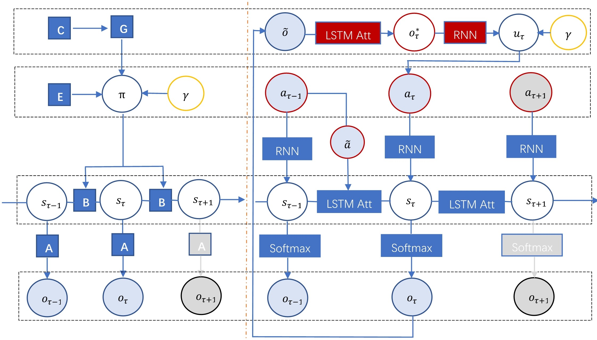
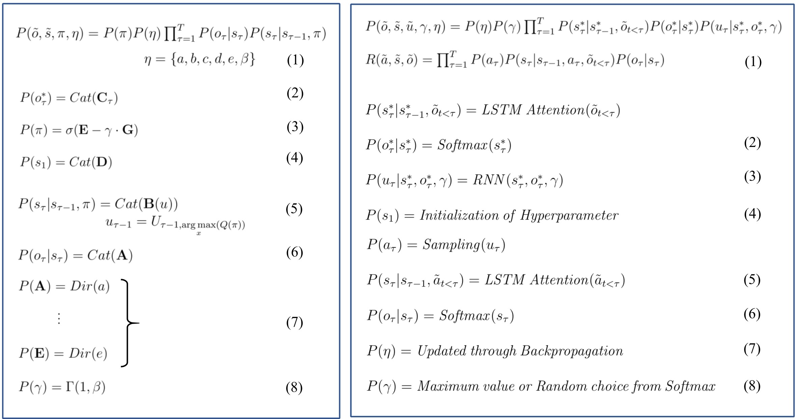

# Deep Active Inference

This is a work I did in my early Ph.D. years 2020-2021 at UC San Diego Computer Music with [Prof. Shlomo Dubnov](https://music-cms.ucsd.edu/people/faculty/regular_faculty/shlomo-dubnov/index.html). We investigated the artificial interactive systems under active inference and the free energy principle to understand how individuals or musicians infer each others' minds and adapt behaviors accordingly in a communicative or collective context. 

- This work was presented at Prof. Karl Friston's Theoretical Neurobiology Seminar at University College London on June 10th, 2021 [[presentation slides](https://drive.google.com/file/d/1W5Op0P_I2fS078E3L6AGVdwaEGdfBgca/view?usp=drive_link)].
- This work was presented at the MMM Model Suites: Models and Modelling in Computer Science Seminar at Kiel University, Germany, on June 15th, 2021 [[presentation slides](https://drive.google.com/file/d/1xfXOJbGd7-8pF3BsQV1B9tHRels2cqZQ/view)].

<caption>
 Figure 1. Deep Markov Decision Process. Neural Network Implementation of MDP. 
</caption>

- **Deep neural network implementation of active inference**: By coupling two LSTM attention neural networks as the perception-action cycle indicates, we simulate the inference-action process between the agent and environment under the free energy principle (the environment is treated as another agent with the same inference ability).
    
- **Variational niche construction via a way of ''[thinking through other minds](https://sandervandecruys.be/pdf/2020_VandeCruysHeylighenBBS_Dark_side.pdf)''**: By generalizing the vanilla agent-environment model, we proposed a linguistic communication model that positions the agent and environment at equal status, thus constructing the niche interactively by active inference.

- **Real-time synchronization \& collective improvisation**: A music model that favors the active niche construction but achieves real-time synchronization is established, which addresses the ''collective improvisation'' problem widely studied in music performance especially free jazz [[Free Play: Improvisation in Life and Art](https://www.scribd.com/document/121769908/Free-Play-Improvisation-in-Life-and-Art)].

<caption>
 Figure 2. Action-Perception Loop of Linguistic Communication Model. 
</caption>
