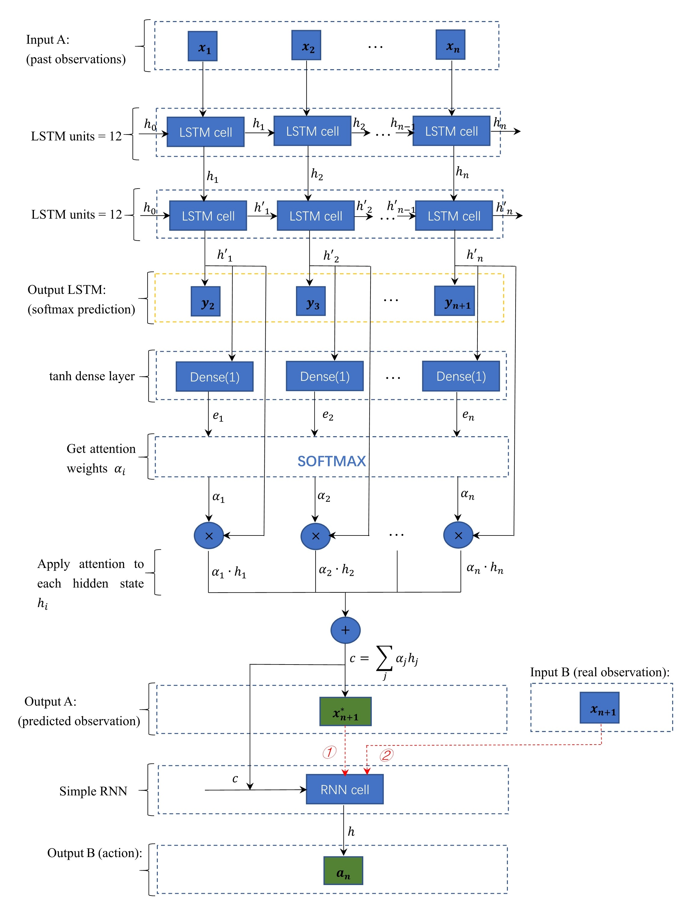

# Deep Active Inference

<caption>
 Figure 3. LSTM cell. A recurrent neural network with forget and update gates that capture longer time dependencies. 
</caption>

<caption>
 Figure 3. LSTM cell. A recurrent neural network with forget and update gates that capture longer time dependencies. 
</caption>
